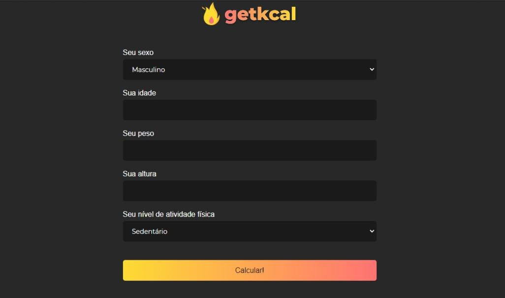
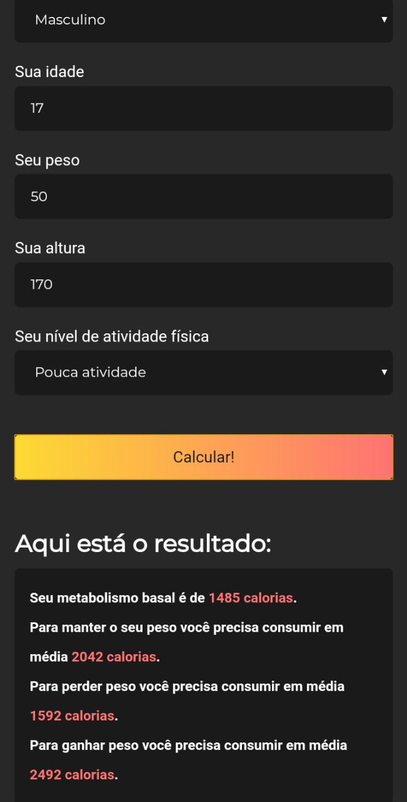

#  :fire: Conheça o **`Getkcal`** :fire:
Um aplicativo minimalista para calcular as calorias do usuário e ajudá-lo a chegar ou manter o corpo desejado feito com javascipt puro.

**[Clique aqui](https://luigi-raynel-dev.github.io/getkcal/) para acessar o site do projeto**

## `DESCRIÇÃO DO PROJETO`:scroll:
Esta aplicação permite que você calcule sua taxa metabólica basal e com os dados fornecidos pelo usuário será feito um outro cálculo informando ao usuário quantos calorias ele deve consumir para continuar com seu corpo, perder peso ou ganhar peso. Uma ferramenta muito útil que informará o usuário quanto ele precisa consumir para alcançar ou manter o corpo desejado.
# * 。 • ˚ ˚ ˛ ˚ ˛ • 。* 。° 。* 。 • ˚* 。 • ˚ ˚ ˛ ˚ ˛ • 。* 。° 。* 。 • ˚
### `Imagens do projeto`📷
>Desktop :computer:

 ----
>Mobile :vibration_mode:

>Obtenha Resultados imediatamente :fire:

 ----
# * 。 • ˚ ˚ ˛ ˚ ˛ • 。* 。° 。* 。 • ˚* 。 • ˚ ˚ ˛ ˚ ˛ • 。* 。° 。* 。 • ˚
### `O QUE EU APRENDI COM O PROJETO?` :thinking:
*Pratiquei e aperfoiçoei minha logica para com a regra de negócio fazendo que assim eu possa evoluir tanto na linguagem javascript, mas também na construção de uma aplicação.*